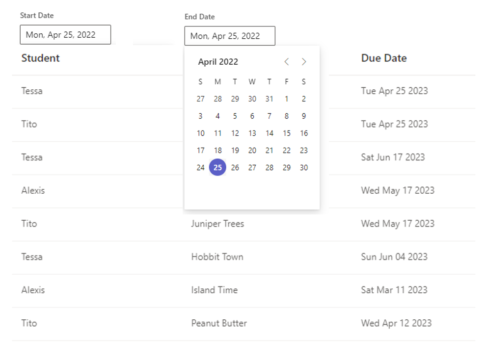

# EDU Take Home Challenge
Thank you for choosing to interview with us and show us your skills with a take home challenge ✨

Diversity and inclusion is one of the major focus points for the EDU team and Microsoft as a whole. We recognize that live coding challenges are not for everyone, and are excited to provide candidates the opportunity to showcase their skills in an alternative way. 

## Setting the Scene
We designed this take home challenge to more closely mimic what the job is like day to day. For the purposes of this challenge, imagine the following scenario:

>The EDU Team is creating a new product that can keep track of assignments for teachers. So far, the product is only a static list of assignment details. After talking to a lot of teachers, the PM on the team decides that the biggest need for teachers is the ability to filter assignments by due date. A designer takes this spec and gives you the following design:

> 
> "Currently we only have a static list of assignments. Please add one input field for Start Date, and one input field for End Date. When clicked, a calendar picker should appear to select dates. These date fields should automatically filter the assignment list."

Now it's your job to start implementing this new feature!

## Get Started
This repo includes everything you should need to get started
1. Make sure you have [Node.js v14.17.0 or higher installed](https://nodejs.org/en/download/)
2. Clone the repo
3. Run `yarn install` to install the necessary packages
4. Run `yarn dev` to run the project locally 

## Logistics
- Please spend no more than 2 hours on this challenge. Feel free to document anything you didn't get time to implement.

- You are encouraged to use the open source components from Fluent UI. You can find the [documentation here](https://developer.microsoft.com/en-us/fluentui#/controls/web). Feel free to change, edit, or add anything in the repo, including using other open source resources.

- There is a unit test set up for you. Consider adding more.

- At least 12 hours before your scheduled interview, please send the hiring manager a public link to your repo with your changes.

- During at least one of your interviews, we will walk through your implementation together. Good luck!